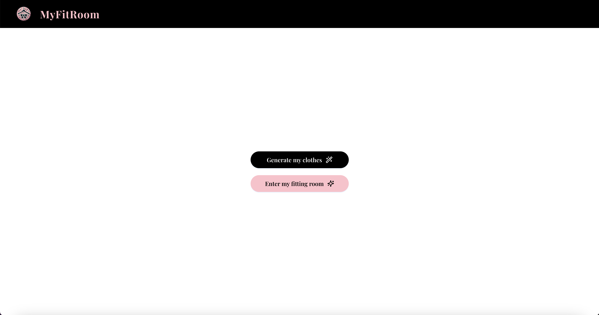
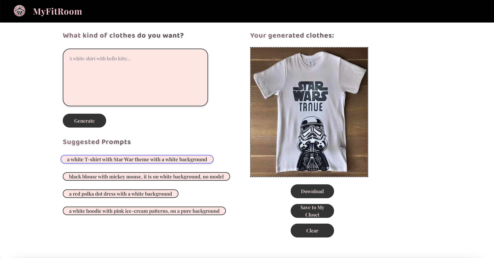
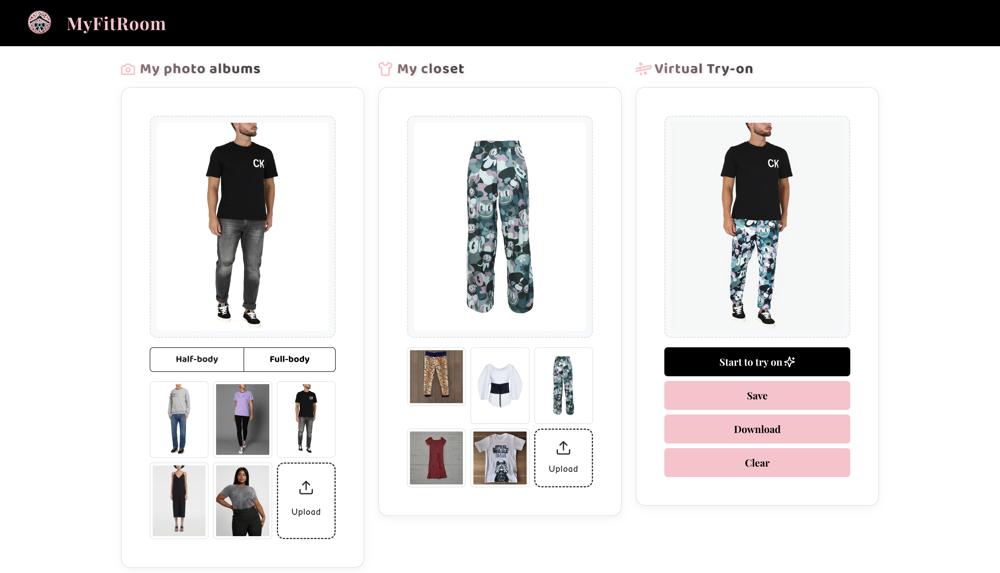

# myFitRoom: Clothes generation and Virtual try-on


## Purpose of This Repository
This is the COSC 6480 Experiment AI final project for group: Avery Bai, Jiayi You, Xinyi Huang. This repository is created and maintained solely for learning purposes. It is intended to demonstrate the use of various tools, frameworks, and models for educational exploration and non-commercial activities.

## Interface Preview





## Running the application
Git clone this repository and open it to your IDE

Run
```bash
cd interface/react-app
```
Run the following command to install all required packages for this program
```bash
npm install 
```
Check if you install vite
```bash
vite --version
```
if it is installed, then run this to see the web app
```bash
npm run dev
```
We run this application on port 5173. Click this http://localhost:5173/ to view.

## Running the model
We run these models on Google Colab. All of the Google Colab notebooks are saved in the notebooks directory. To run these notebooks properly, follow these steps:

-  Download Required Files:

    - Download the notebooks folder and the OOTDiffusion folder.

    - Upload these to your Google Drive.

- Adjust File Paths:

    - Ensure you update the file paths in the notebooks to match your Google Drive directory structure.

- Set Runtime to A100 GPU:

    - Change the runtime type in Google Colab to A100 GPU for optimal performance.

    - Note: A100 GPUs cost approximately $10 per 100 computing units.

- File Paths in Notebooks:

    - You may notice different import and export file paths in our notebooks because we uploaded OOTDiffusion to our own Drive, so there will be slight different between the current OOTDiffusion folder and the version on our google drive. If you want to run our scripts directly without change any path, please save the folder using link https://drive.google.com/drive/folders/1J1aU0RBc-zH-KjIQ7nBmkEfzWWfVDQhb to your google drive. 

    - Currently, we use a submodule to point the OOTDiffusion folder to its original directory.


## Data input and output
We require prompts specifically for the clothes generation model, as well as both model and garment images for the virtual try-on process.

File Structure and Output

- Example Garments and Models: Example garments and model images for virtual try-on are available in OOTDiffusion/run/examples. We also uploaded our own images as models to test the model.

- Generated Clothes Output:
    - The generated output is saved in the folder notebooks/generated_clothes.

    - In our original notebook and Google Drive, the generated clothes images are saved to OOTDiffusion/run/saved_images.

- Virtual Try-On Output:

    - Virtual try-on results are saved in the folder notebooks/images_output.

    - In our original notebook and Google Drive, the virtual try-on images are saved to OOTDiffusion/run/images_output.


## Model Usage Disclaimer
1. OOTDiffusion
We incorporate and use the OOTDiffusion model, available at OOTDiffusion on Hugging Face. This model is not owned by us and remains the property of its respective creator. All rights, credits, and ownership belong to the original author.

2. LoRA Text2Image Fine-Tuning - sd-fashion-products
We utilize the sd-fashion-products model for learning purposes, which can be found at sd-fashion-products on Hugging Face. This model is also not owned by us and remains under the ownership of its original author. All rights and credits are retained by the model's creator.

We explicitly state that:
All models, tools, and frameworks used in this repository are for educational purposes only.
We do not use these models for any commercial activities.
We fully acknowledge the ownership and intellectual property rights of the respective model authors.
For further information on these models, please refer to their respective links:

[OOTDiffusion](https://huggingface.co/levihsu/OOTDiffusiongi)

[LoRA-Text2Image-FineTUning-NouRed/sd-fashion-products](https://huggingface.co/NouRed/sd-fashion-products)
If there are any concerns or queries, feel free to contact us.

## Citations

If you find this project useful for your research, please use the following BibTeX entries:
```bibtex
@software{NouredFashionProducts2023,
    author = {NouRed},
    title = {sd-fashion-products: LoRA weights for Stable Diffusion 2 fine-tuned on fashion product images},
    year = {2023},
    publisher = {Hugging Face},
    journal = {Hugging Face Model Hub},
    url = {https://huggingface.co/NouRed/sd-fashion-products}
}
```
```bibtex
@InProceedings{hsu2023ootdiffusion,
    title = {OOTDiffusion: Outfitting Fusion based Virtual Try-on using Diffusion Model},
    author = {Hsu, Wei-Lin and Huang, Hsin-Ying and Tsai, Yi-Syuan and Tseng, Wei-Chen},
    booktitle = {ICCV 2023 Workshop},
    year = {2023},
    url = {https://huggingface.co/levihsu/OOTDiffusion}
}
```
